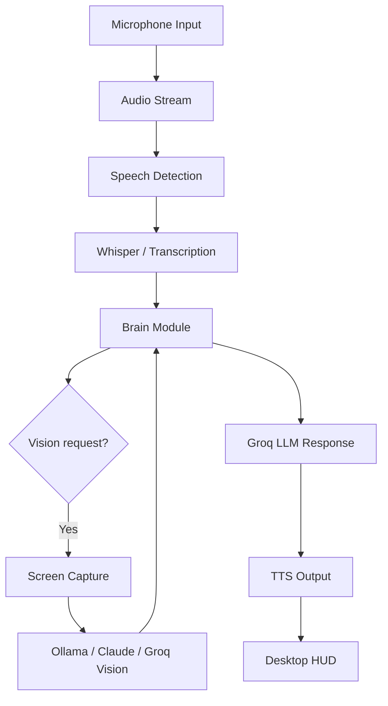

# Architecture Overview

## High-level flow

## Modules

### `main.py`
Entry point for the application. Initializes the UI and starts the main event loop.

### `modules/audio.py`
Handles microphone capture, silence detection, wake-state logic, and speech processing.

### `modules/brain.py`
Contains the primary reasoning flow:
- prompt validation
- shutdown logic
- optional screen analysis
- final LLM response generation

### `modules/config.py`
Stores environment variables and application-wide constants.

### `modules/vision.py`
Responsible for:
- screen capture
- image compression to base64
- Ollama-based local vision
- Anthropic fallback
- Groq fallback logic

### `modules/hud.py`
Controls the desktop HUD and state updates shown to the user.

### `modules/tts.py`
Provides speech output via `pyttsx3`.

## Design principles

- Local-first where possible
- Graceful fallback between providers
- Clear separation of concerns between audio, reasoning, and UI
- Minimal dependency on paid services unless configured

## Provider strategy

The project tries to follow this order:

1. Ollama local vision if available
2. Anthropic Claude if API key exists
3. Groq model fallback for chat and vision if enabled

This makes the system more flexible when network or API access is limited.
